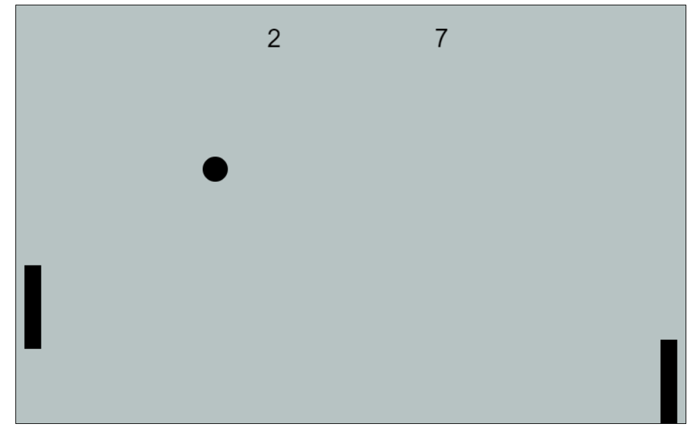

.

# About Project

This project shows the "Pong" game. This game comes from 1972. I saw this project in book "Java Script od podstaw. Zacznij swoją przygodę z programowaniem". Author: Marcin Moskała. The rules of the game is very simply. On the board of game are: two rectangles and one ball and result. You have to moves own rectangle (some "rocekt") to hit the ball. If you don't hit the ball your opponent scores point. The "Rocket" on the left is controlled by two keys: "a" to up and "z" to down. The "Rocket" on the right is controlled by another two keys: "p" to up and "l" to down. 

# One of scrap of code.

```
<!DOCTYPE html>
<html lang="en">
  <head>
    <meta charset="UTF-8" />
    <meta name="viewport" content="width=device-width, initial-scale=1.0" />
    <title>The Pong Game</title>
    <!--     <link rel="stylesheet" href="style.css"> -->
  </head>
  <body>
    <div class="canvasContainer">
      <canvas
        id="gameCanvas"
        width="800"
        height="500"
        style="
          border: 1px solid;
          background-color: rgb(183, 195, 195);
          margin-left: 50px;
        "
      ></canvas>
    </div>
    <script src="app.js"></script>
  </body>
</html>

```

- code fragment of the "Ball" class:

```
class Ball {
    constructor() {
        this.x = BALL_START_X;
        this.y = BALL_START_Y;
        this.dx = BALL_START_DX;
        this.dy = BALL_START_DY;
    }

    move(p1, p2) {

        if (this.shouldBounceFromTopWall() ||
            this.shouldBounceFromBottomWall()) {
            this.bounceFromWall();
        }
        if (this.shouldBounceFromLeftPaddle(p1.paddle) ||
            this.shouldBounceFromRightPaddle(p2.paddle)) {
            this.bounceFromPaddle();
        }
        if (this.isOutsideOnLeft()) {
            this.moveToStart();
            p2.points++;
        } else if (this.isOutsideOnRight()) {
            this.moveToStart();
            p1.points++;
        }
        this.x += this.dx;
        this.y += this.dy;
    }

    draw (){
        drawCircle(this.x, this.y, BALL_R)
    }
```

# Technologies

In this project I used HTML Canvas. This is one of elements HTML language. It was added in HTML 5. HTML Canvas allows draw some figures by function.
We have to create area to draw it and set the context. For example the code in below create the black rectangle.

```
var canvas_area = document.getElementById('canvas_area');
var context = canvas_area.getContext('2d');
context.fillStyle = "rgb(255,255,255)";
context.fillRect(15, 15, 25, 25);

```

Some tutorial to HTML Canvas:
https://www.w3schools.com/html/html5_canvas.asp

